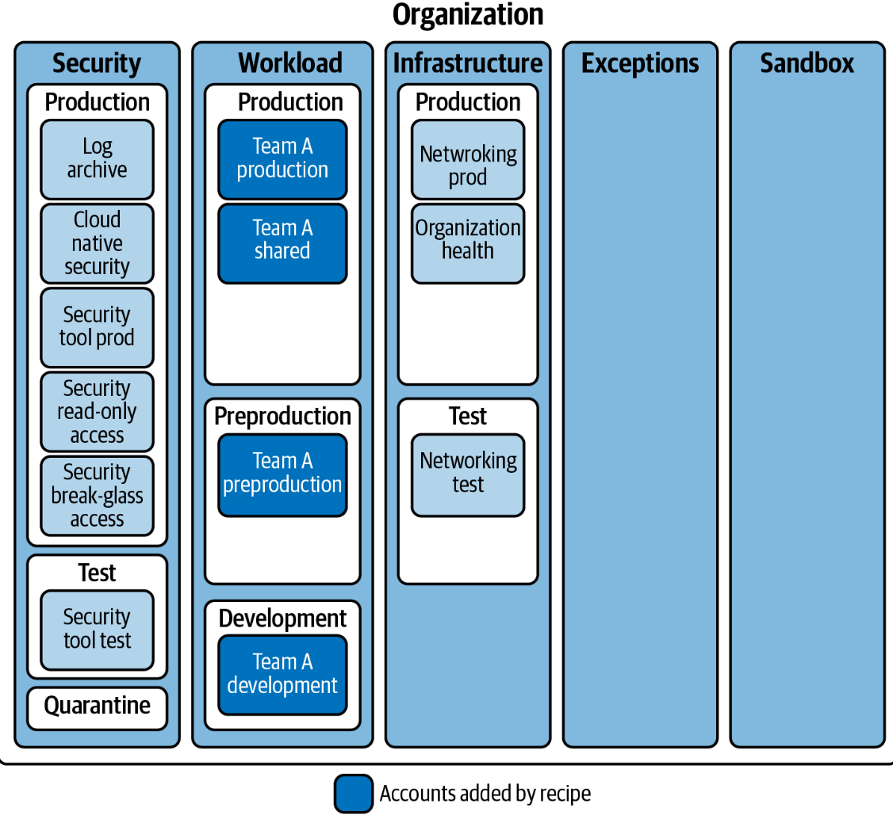

#  Cloud Enterprise Accounts & Users (GCP | AWS | Azure)

This repository demonstrates **enterprise-grade cloud foundations** for identity and access management across the **three major cloud providers**:  
- **Google Cloud Platform (GCP)**  
- **Amazon Web Services (AWS)**  
- **Microsoft Azure**

It encodes best practices using **Terraform**, with a focus on:  
-  **Scalable project/account/subscription structures**  
-  **Region-level guardrails for compliance**  
-  **Centralized user onboarding with least-privilege IAM**  

---

##  Repository Structure

```bash
cloud-enterprise-accounts-and-users/
│
├── gcp/
│   ├── scalable-project-structure/
│   ├── region-locking/
│   └── centralizing-users/
│
├── aws/
│   ├── scalable-account-structure/
│   ├── region-locking/
│   └── centralizing-users/
│
└── azure/
    ├── scalable-subscription-structure/
    ├── region-locking/
    └── centralizing-users/
````

Each folder contains:

* `variables.tf` / `terraform.tfvars` → input definitions
* `provider.tf` → provider setup
* `main.tf` → main resources
* `README.md` → project-specific notes

---

##  Implementations

###  Google Cloud Platform (GCP)

**Scalable Project Structure**

- Creates standardized projects for **Prod, PreProd, Dev, and Shared** under correct folders.  
- Ensures isolation, least-privilege IAM, and centralized infra.

  


**Region Locking**

- Applies **org-level policies** restricting deployments to approved regions.
- Supports compliance with **GDPR, HIPAA, PCI** and reduces attack surface.


**Centralizing Users**

- Automates onboarding of Workspace users and groups.
- Example: `payments-team@domain` with Jane Doe + John Smith.
= Group assigned `roles/viewer` at project level.


---

###  Amazon Web Services (AWS)

**Scalable Account Structure**

- Builds **Prod, PreProd, Dev, Shared** accounts under a team-specific OU.
- Supports workload isolation and strong SCP enforcement.
  


**Region Locking**

- Enforces **Service Control Policies (SCPs)** to allow only approved AWS regions.
- Maintains exception list for global services (e.g., CloudFront in `us-east-1`).

**Centralizing Users**

- All IAM users exist in a dedicated **Auth account**.
- Cross-account roles grant **least-privilege access** to workloads.

---

###  Microsoft Azure

**Scalable Subscription Structure**

- Creates **Prod, PreProd, Dev, Shared** subscriptions under Mgmt Groups.
- Organizes via **Sandbox, Platform, Landing Zones** hierarchy.


**Region Locking**

- Uses **Azure Policy** to enforce region restrictions.
- Built-in exceptions support global services.

**Centralizing Users**

- Onboards Azure AD users via Terraform with **random initial passwords**.
- Users are grouped for role assignment (Reader, Contributor, etc.).

---

---

## ⚡ Quickstart Example (GCP)

```bash
# Navigate to a project
cd gcp/centralizing-users

# Initialize providers
terraform init

# Review plan
terraform plan -var-file=terraform.tfvars

# Apply changes
terraform apply -var-file=terraform.tfvars
```

To view generated user passwords:

```bash
terraform output passwords
```

---

##  Why This Repo Matters

* **Governance-as-Code** → scalable org/account/subscription hierarchy
* **Compliance-as-Code** → enforce regional guardrails programmatically
* **Identity-as-Code** → automated onboarding for users and teams

> 💡 This repo demonstrates the capability to **design, secure, and scale multi-cloud estates** 

---

##  Billing Consideration

* **GCP Projects/Folders/Groups** → free unless resources run inside.
* **Google Workspace Users** → billed per seat (suspend/delete test users to avoid charges).
* **AWS & Azure** → IAM/AAD users and groups are free; you only pay for resources.

For labs, destroy infra after testing (`terraform destroy`) but you can safely leave Org/OU/Mgmt structures without ongoing costs.

---